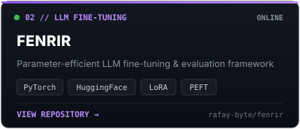
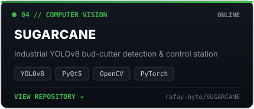
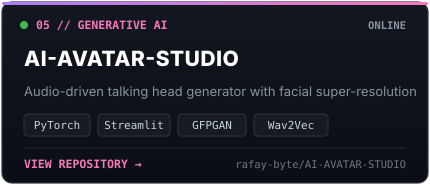
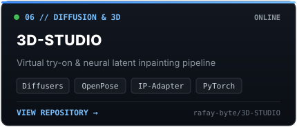
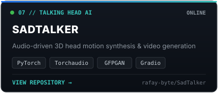
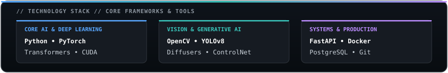
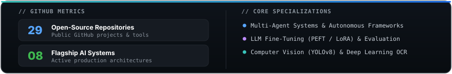

<!-- HERO TERMINAL SYSTEM -->

 

<!-- AI SYSTEM ARCHITECTURE -->

  

 

<!-- PROJECT MATRIX (THE CENTERPIECE) -->
<h3 align="left">// PROJECT MATRIX</h3>

<table width="100%">
<tr>
<td width="50%" align="center">
  
</td>
<td width="50%" align="center">
  
</td>
</tr>
<tr>
<td width="50%" align="center">
  
</td>
<td width="50%" align="center">
  
</td>
</tr>
<tr>
<td width="50%" align="center">
  
</td>
<td width="50%" align="center">
  
</td>
</tr>
<tr>
<td width="50%" align="center">
  
</td>
<td width="50%" align="center">
  
</td>
</tr>
</table>

  

 

<!-- TECHNOLOGY MATRIX -->
<h3 align="left">// TECHNOLOGY STACK</h3>

  

 

<!-- GITHUB ANALYTICS -->
<h3 align="left">// GITHUB ANALYTICS</h3>

  

 

<!-- MINIMAL FOOTER -->

  RAFAY-BYTE // AI LAB &bull; Built with precision by <a href="https://github.com/rafay-byte">Abdul Rafay Khalid</a>

