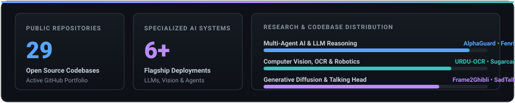

<div align="center">

<!-- HERO TERMINAL SYSTEM -->


<p align="center">
  <a href="https://github.com/rafay-byte"></a>
  &nbsp;
  <a href="https://github.com/rafay-byte?tab=repositories"></a>
  &nbsp;
  
  &nbsp;
  
</p>

</div>

---

### // NEURAL ARCHITECTURE FLOW // DATA TO PRODUCTION

<div align="center">
  
</div>

---

### // MISSION CONTROL // CORE SPECIALIZATION CHANNELS

<div align="center">
  
</div>

---

<!-- PROJECT MATRIX HEADER -->
<div align="center">
  
</div>

<table width="100%">
<tr>
<td width="50%" valign="top">

```
┌────────────────────────────────────────────────────────┐
│ ◉ 01 / ALPHAGUARD AI                                   │
│                                                        │
│ MULTI-AGENT AI INVESTMENT COMMITTEE                    │
│                                                        │
│ Market Feed ──▶ 8 Agents ──▶ Bull/Bear ──▶ Risk Engine │
│                                                        │
│ • 8 Specialized Agents (Macro, Sentiment, Bull, Bear)  │
│ • Zero-LLM Risk Authority (Deterministic Python Engine)│
│ • Alpaca API Paper Options Execution & Post-Mortem     │
│                                                        │
│ STACK: Python • LLMs • MCP • Flask • Alpaca API        │
│ ────────────────────────────────────────────────────── │
│ https://github.com/rafay-byte/alphaguard             → │
└────────────────────────────────────────────────────────┘
```
<div align="center">
  <a href="https://github.com/rafay-byte/alphaguard"><b>[ VIEW REPOSITORY &rarr; ]</b></a>
</div>

</td>
<td width="50%" valign="top">

```
┌────────────────────────────────────────────────────────┐
│ ◉ 02 / FENRIR                                          │
│                                                        │
│ LLM FINE-TUNING & BENCHMARK FRAMEWORK                  │
│                                                        │
│ Base LLM ──▶ LoRA/QLoRA ──▶ Dual Benchmark ──▶ Report  │
│                                                        │
│ • Base Model: TinyLlama-1.1B-Chat-v1.0                 │
│ • Tuning: LoRA + QLoRA (PEFT, r=8, alpha=16)           │
│ • 150+ CLI Q&A Pairs • RTX 3050 CUDA Acceleration     │
│ • Comparative Side-by-Side Eval Suite (report.md)      │
│                                                        │
│ STACK: PyTorch • HuggingFace • LoRA • PEFT • CUDA      │
│ ────────────────────────────────────────────────────── │
│ https://github.com/rafay-byte/fenrir                 → │
└────────────────────────────────────────────────────────┘
```
<div align="center">
  <a href="https://github.com/rafay-byte/fenrir"><b>[ VIEW REPOSITORY &rarr; ]</b></a>
</div>

</td>
</tr>
<tr>
<td width="50%" valign="top">

```
┌────────────────────────────────────────────────────────┐
│ ◉ 03 / URDU-OCR                                        │
│                                                        │
│ DEEP LEARNING OCR FOR RIGHT-TO-LEFT SCRIPT             │
│                                                        │
│ Urdu Image ──▶ Preprocess ──▶ PyTorch Model ──▶ Text   │
│                                                        │
│ • Custom Character-to-Index Mapping for Cursive Urdu   │
│ • CUDA-Accelerated Deep Learning Training Pipeline     │
│ • Automated Convergence Tracking (Loss/Accuracy Plots) │
│ • 5MB TSV Dataset Image-Text Transcription Pairs       │
│                                                        │
│ STACK: PyTorch • CUDA • OpenCV • Pandas • TSV          │
│ ────────────────────────────────────────────────────── │
│ https://github.com/rafay-byte/URDU-OCR               → │
└────────────────────────────────────────────────────────┘
```
<div align="center">
  <a href="https://github.com/rafay-byte/URDU-OCR"><b>[ VIEW REPOSITORY &rarr; ]</b></a>
</div>

</td>
<td width="50%" valign="top">

```
┌────────────────────────────────────────────────────────┐
│ ◉ 04 / SUGARCANE                                       │
│                                                        │
│ INDUSTRIAL YOLOv8 BUD CUTTER CONTROL STATION           │
│                                                        │
│ Camera Feed ──▶ YOLOv8 ──▶ Spatial Coords ──▶ Cutter   │
│                                                        │
│ • Real-Time Detection: Classes {0: 'bud', 1: 'strip'}  │
│ • PyQt5 Desktop Station with Motor & Rotation Speed    │
│ • Millisecond-Level Pneumatic Cutter Timing Triggers   │
│ • Multi-Background Illumination Dataset Consolidation  │
│                                                        │
│ STACK: Ultralytics YOLOv8 • PyQt5 • PyTorch • OpenCV   │
│ ────────────────────────────────────────────────────── │
│ https://github.com/rafay-byte/SUGARCANE              → │
└────────────────────────────────────────────────────────┘
```
<div align="center">
  <a href="https://github.com/rafay-byte/SUGARCANE"><b>[ VIEW REPOSITORY &rarr; ]</b></a>
</div>

</td>
</tr>
<tr>
<td width="50%" valign="top">

```
┌────────────────────────────────────────────────────────┐
│ ◉ 05 / AI-AVATAR-STUDIO                                │
│                                                        │
│ AUDIO-DRIVEN TALKING HEAD GENERATOR                    │
│                                                        │
│ Portrait + Audio ──▶ Landmarks ──▶ Visemes ──▶ GFPGAN  │
│                                                        │
│ • Premium Streamlit Cyberpunk/Dark UI Interface        │
│ • Audio Lip-Sync Phoneme-to-Viseme Mouth Alignment     │
│ • Integrated GFPGAN Detail & Facial Super-Resolution   │
│ • Motion Control: Pose, Expression & Tilt Parameters   │
│                                                        │
│ STACK: PyTorch • Streamlit • GFPGAN • Wav2Vec • Cog    │
│ ────────────────────────────────────────────────────── │
│ https://github.com/rafay-byte/AI-AVATAR-STUDIO       → │
└────────────────────────────────────────────────────────┘
```
<div align="center">
  <a href="https://github.com/rafay-byte/AI-AVATAR-STUDIO"><b>[ VIEW REPOSITORY &rarr; ]</b></a>
</div>

</td>
<td width="50%" valign="top">

```
┌────────────────────────────────────────────────────────┐
│ ◉ 06 / 3D-STUDIO                                       │
│                                                        │
│ VIRTUAL TRY-ON & NEURAL INPAINTING PIPELINE            │
│                                                        │
│ Garment + Photo ──▶ OpenPose ──▶ IP-Adapter ──▶ Paint  │
│                                                        │
│ • IP-Adapter Conditioning for Consistent Textures      │
│ • OpenPose Human Skeleton Keypoint Detection           │
│ • Automated Multi-Class Garment & Human Segmentation   │
│ • Latent Inpainting for Realistic Virtual Fitting      │
│                                                        │
│ STACK: Diffusers • OpenPose • IP-Adapter • PyTorch     │
│ ────────────────────────────────────────────────────── │
│ https://github.com/rafay-byte/3D-STUDIO              → │
└────────────────────────────────────────────────────────┘
```
<div align="center">
  <a href="https://github.com/rafay-byte/3D-STUDIO"><b>[ VIEW REPOSITORY &rarr; ]</b></a>
</div>

</td>
</tr>
<tr>
<td width="50%" valign="top">

```
┌────────────────────────────────────────────────────────┐
│ ◉ 07 / SADTALKER                                       │
│                                                        │
│ AUDIO-DRIVEN 3D HEAD MOTION SYNTHESIS                  │
│                                                        │
│ Audio WAV ──▶ 3D Motion Coeffs ──▶ Face Morph ──▶ MP4  │
│                                                        │
│ • Realistic 3D Motion Coefficients from Acoustic Audio │
│ • Dual Web Application Modes: Streamlit & Gradio       │
│ • High-Fidelity 512x512 Conversational Video Outputs   │
│ • Tested on RTX 3080 10GB Workstation (~2 min for 30s) │
│                                                        │
│ STACK: PyTorch • Torchaudio • GFPGAN • Gradio • OpenCV │
│ ────────────────────────────────────────────────────── │
│ https://github.com/rafay-byte/SadTalker              → │
└────────────────────────────────────────────────────────┘
```
<div align="center">
  <a href="https://github.com/rafay-byte/SadTalker"><b>[ VIEW REPOSITORY &rarr; ]</b></a>
</div>

</td>
<td width="50%" valign="top">

```
┌────────────────────────────────────────────────────────┐
│ ◉ 08 / FRAME2GHIBLI                                    │
│                                                        │
│ VIDEO-TO-GHIBLI STYLE TRANSFER PIPELINE                │
│                                                        │
│ Video Frames ──▶ Canny ──▶ ControlNet + Meina ──▶ Video│
│                                                        │
│ • Adaptive Canny Edge Guidance for Structural Stability│
│ • Stable Diffusion MeinaMix V11 / Anything-V5 Pipeline │
│ • CUDA-Accelerated Watermark Inpainting (STACK.py)     │
│ • Temporal Frame Reassembly & Audio Sync (output.py)   │
│                                                        │
│ STACK: Diffusers • ControlNet • Stable Diffusion • CUDA│
│ ────────────────────────────────────────────────────── │
│ https://github.com/rafay-byte/FRAME2GHIBLI           → │
└────────────────────────────────────────────────────────┘
```
<div align="center">
  <a href="https://github.com/rafay-byte/FRAME2GHIBLI"><b>[ VIEW REPOSITORY &rarr; ]</b></a>
</div>

</td>
</tr>
</table>

<div align="center">

```
═══════════════════════════════════════════════════════════════════════════════════
  [ ──▶ EXPLORE ALL 29 ACTIVE OPEN-SOURCE REPOSITORIES ON GITHUB ◀── ]
═══════════════════════════════════════════════════════════════════════════════════
```
<a href="https://github.com/rafay-byte?tab=repositories"><b>&rarr; Click to View Full 29-Project Repository Portfolio &larr;</b></a>

</div>

---

### // TECHNOLOGY MATRIX // CORE STACK

<div align="center">
  
</div>

---

### // ENGINEERING TRAJECTORY // MILESTONES

<div align="center">
  
</div>

---

### // SYSTEM ANALYTICS // PORTFOLIO METRICS

<div align="center">
  
</div>

---

<div align="center">

### // ESTABLISH CONNECTION //

Open to technical collaborations in **Multi-Agent Architectures**, **LLM Fine-Tuning**, and **Generative Vision**.

<a href="https://github.com/rafay-byte"></a>
&nbsp;
<a href="https://github.com/rafay-byte?tab=repositories"></a>

<br/><br/>
<sub>terminal // rafay@ai-lab:~ &bull; Built with precision by <a href="https://github.com/rafay-byte">Abdul Rafay Khalid</a></sub>

</div>
