<div align="center">

<!-- HERO SYSTEM BANNER -->
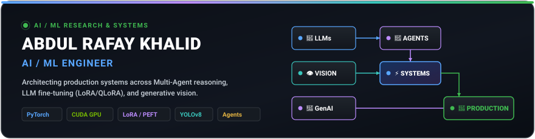

<p align="center">
  <a href="https://github.com/rafay-byte"></a>
  <a href="https://github.com/rafay-byte?tab=repositories"></a>
  
  
</p>

</div>

---

### ⚡ AI Engineering Lifecycle

<div align="center">
  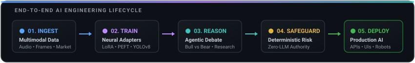
</div>

---

## 🛡️ CURRENTLY BUILDING: [AlphaGuard AI](https://github.com/rafay-byte/alphaguard)

> **Autonomous 8-Agent Investment Committee & Options Trading Platform with Deterministic Risk Controls**

<div align="center">
  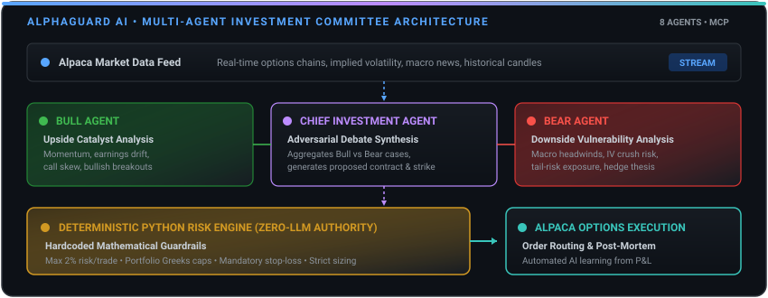
</div>

<br/>

| Metric / Dimension | Production Specification |
|:---|:---|
| **Agent Architecture** | **8 Specialized Agents** (Macro Research, Fundamental, Bull & Bear Adversaries, Synthesizer) |
| **Reasoning Engine** | Adversarial Bull vs. Bear debate synthesis to isolate bias and downside tail-risk |
| **Risk Control** | **Deterministic Python Engine (Zero-LLM Authority)** — Strict 2% portfolio limits, Greeks caps, stop-loss |
| **Execution Broker** | **Alpaca API** paper options routing with automated post-mortem learning loop |
| **Tech Stack** | `Python 3.10+` &bull; `Multi-Agent Systems` &bull; `Model Context Protocol (MCP)` &bull; `Alpaca Trading API` &bull; `Flask` |

<div align="center">
  <a href="https://github.com/rafay-byte/alphaguard"><b>Explore AlphaGuard Architecture &amp; Code &rarr;</b></a>
</div>

---

## 🚀 FEATURED SYSTEMS SHOWCASE

### Tier 1 &bull; Flagship Engineering

<table width="100%">
<tr>
<td width="50%" valign="top">

### 🐺 [Fenrir](https://github.com/rafay-byte/fenrir)
**Parameter-Efficient LLM Fine-Tuning Framework**

End-to-end framework fine-tuning open-source LLMs on specialized domain datasets using LoRA adapters, followed by rigorous baseline-vs-adapter comparative benchmarking.

<div align="center">
  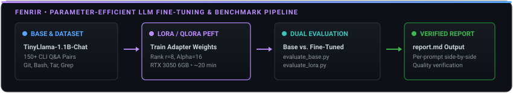
</div>

| Parameter | Verified Specification |
|:---|:---|
| **Base Model** | TinyLlama-1.1B-Chat-v1.0 |
| **Tuning Method** | LoRA + QLoRA (PEFT, $r=8$, $\alpha=16$) |
| **Dataset** | 150+ CLI Q&A Pairs (Git, Bash, Tar, Grep) |
| **Evaluation** | Automated dual benchmark suite (`report.md`) |
| **Hardware** | NVIDIA RTX 3050 6GB (~20 min training) |

<div align="center">
  <a href="https://github.com/rafay-byte/fenrir"><b>View Fenrir Repository &rarr;</b></a>
</div>

</td>
<td width="50%" valign="top">

### 📝 [URDU-OCR](https://github.com/rafay-byte/URDU-OCR)
**Deep Learning OCR for Right-to-Left Urdu Script**

Specialized deep learning OCR engine built to recognize cursive, context-dependent Urdu script characters from raw image inputs with GPU-accelerated training.

<div align="center">
  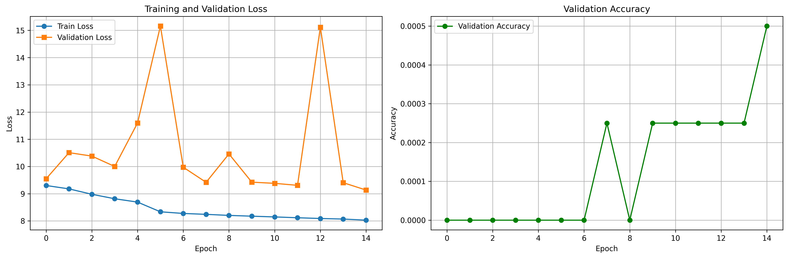
</div>

| Parameter | Verified Specification |
|:---|:---|
| **Architecture** | Deep Learning OCR with CUDA acceleration |
| **Vocabulary** | Custom character-to-index mapping for Urdu |
| **Dataset** | `final_main_dataset.tsv` (~5MB image-text pairs) |
| **Monitoring** | Automated loss/accuracy curve generator |
| **Tech Stack** | `PyTorch` &bull; `CUDA` &bull; `OpenCV` &bull; `Pandas` |

<div align="center">
  <a href="https://github.com/rafay-byte/URDU-OCR"><b>View URDU-OCR Repository &rarr;</b></a>
</div>

</td>
</tr>
</table>

---

### Tier 2 &bull; Visual AI &amp; Generative Media

<table width="100%">
<tr>
<td width="50%" valign="top">

### 🎬 [Frame2Ghibli](https://github.com/rafay-byte/FRAME2GHIBLI)
**Video-to-Ghibli Style Transfer Pipeline**

Neural video stylization transforming raw video frames into Studio Ghibli aesthetics using **ControlNet Canny** adaptive edge conditioning and the **MeinaMix V11** diffusion checkpoint.

<div align="center">
  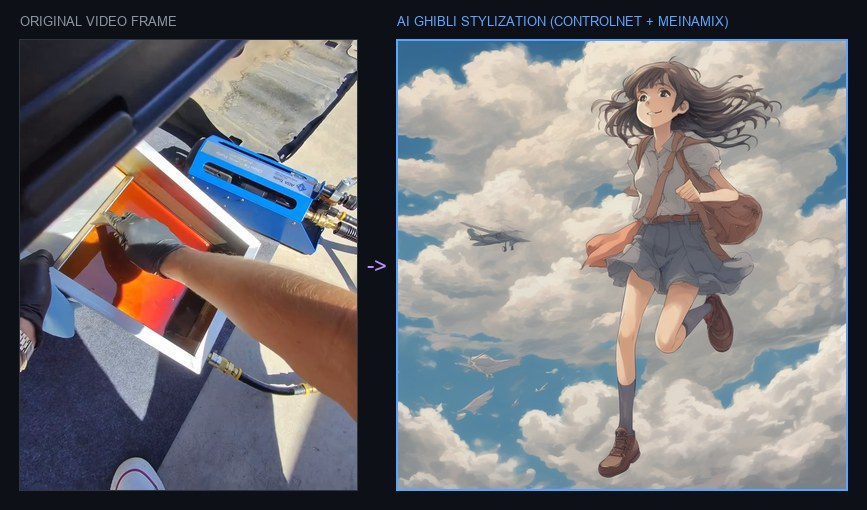
</div>

| Parameter | Verified Specification |
|:---|:---|
| **Conditioning** | Adaptive Canny edge thresholding (median-based) |
| **Diffusion** | MeinaMix V11 / Anything-V5 (`Diffusers`) |
| **Post-Process** | CUDA watermark removal &amp; frame stacking (`STACK.py`) |
| **Tech Stack** | `PyTorch` &bull; `Stable Diffusion` &bull; `ControlNet` &bull; `CUDA` |

<div align="center">
  <a href="https://github.com/rafay-byte/FRAME2GHIBLI"><b>View Frame2Ghibli Repository &rarr;</b></a>
</div>

</td>
<td width="50%" valign="top">

### 🎭 [SadTalker / AI Avatar Studio](https://github.com/rafay-byte/SadTalker)
**Audio-Driven Talking Head Animation**

Generative multimodal system synthesizing conversational talking avatars from a single portrait and audio track with 3D head motion coefficients and **GFPGAN face restoration**.

<div align="center">
  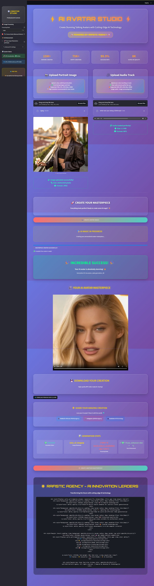
</div>

| Parameter | Verified Specification |
|:---|:---|
| **Resolution** | 256&times;256 and 512&times;512 output generation |
| **Enhancement** | GFPGAN facial restoration super-resolution |
| **Interfaces** | Dual web apps: Streamlit (`launcher.py`) &amp; Gradio |
| **Tested Config** | Intel i7-14700KF &bull; RTX 3080 10GB &bull; 16GB DDR5 |

<div align="center">
  <a href="https://github.com/rafay-byte/SadTalker"><b>View SadTalker Repository &rarr;</b></a>
</div>

</td>
</tr>
</table>

---

### Tier 3 &bull; Applied Computer Vision &amp; Robotics

<table width="100%">
<tr>
<td width="100%" valign="top">

### 🌿 [SUGARCANE](https://github.com/rafay-byte/SUGARCANE) — Industrial YOLOv8 Bud Cutter Control Station

Applied agricultural computer vision and hardware automation. Combines a custom-trained **YOLOv8** model (`bud` and `strip` classes) with an industrial desktop control application (**PyQt5**) for automated sugarcane cutting machinery.

<div align="center">
  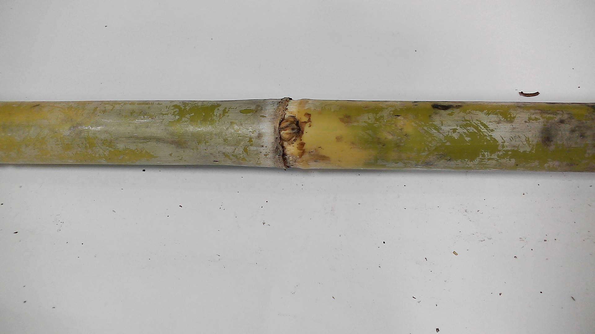
</div>

```
Camera Stream ──▶ YOLOv8 Detection ──▶ Spatial Coordinates ──▶ Pneumatic Cutter Triggers (PyQt5)
```

| Parameter | Verified Specification |
|:---|:---|
| **Model** | Ultralytics YOLOv8 (`yolov8n.pt`) with CUDA acceleration |
| **Detection Targets** | Classes: `0: bud`, `1: strip` (sugarcane node &amp; cutting margins) |
| **Control Software** | PyQt5 Desktop UI (`UI3.py`) with motor speed, rotation, and pneumatic cutter delay |
| **Dataset Pipeline** | Automated train/val/test splitting across varied background illumination |
| **Tech Stack** | `Python` &bull; `Ultralytics YOLOv8` &bull; `PyQt5` &bull; `OpenCV` &bull; `PyTorch CUDA` |

<div align="center">
  <a href="https://github.com/rafay-byte/SUGARCANE"><b>View SUGARCANE Repository &rarr;</b></a>
</div>

</td>
</tr>
</table>

---

## 🧠 AI DOMAINS &amp; SPECIALIZATIONS

<div align="center">
  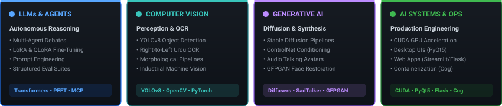
</div>

---

## 🛠️ TECHNOLOGY ECOSYSTEM

<div align="center">
  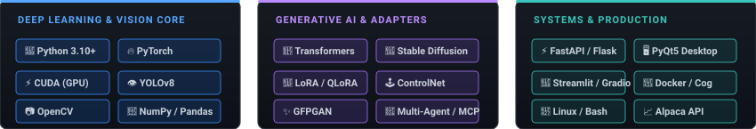
</div>

---

## 📈 ENGINEERING TRAJECTORY

<div align="center">
  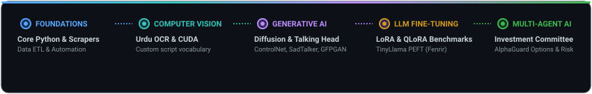
</div>

---

## 📊 ENGINEERING ACTIVITY &amp; ANALYTICS

<div align="center">

<table border="0">
<tr>
<td align="center" valign="middle">
  
</td>
<td align="center" valign="middle">
  
</td>
</tr>
</table>

</div>

---

<div align="center">

### 🤝 Connect &amp; Collaborate

Open to discussions on **Multi-Agent Systems**, **LLM Fine-Tuning**, and **Applied Computer Vision**.

<a href="https://github.com/rafay-byte"></a>
&nbsp;
<a href="https://github.com/rafay-byte?tab=repositories"></a>

<br/><br/>
<sub>Designed &amp; Architected by <a href="https://github.com/rafay-byte">Abdul Rafay Khalid</a> &bull; AI / ML Engineer</sub>

</div>
